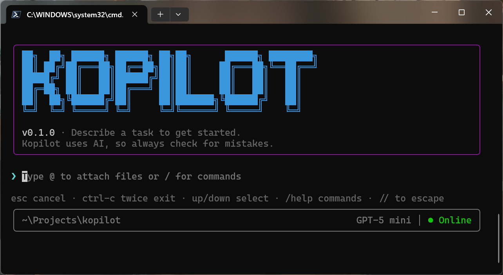

<div align="center">

# Kopilot

**A terminal-based AI assistant powered by the GitHub Copilot SDK**

[](https://nodejs.org)
[](LICENSE)
[](https://github.com/github/copilot-sdk)



*A streaming TUI chat client and template for building domain-specific AI assistants*

</div>

---

## Why Kopilot?

Kopilot isn't just a chat client—it's a **starting point for building your own custom copilots**. The GitHub Copilot SDK lets you create specialized AI assistants with custom tools, and Kopilot provides the foundation:

- 🔧 **Add Tools** — Define domain-specific capabilities (database queries, API calls, file operations)
- 💬 **Customize the Prompt** — Shape how your assistant behaves and what it knows
- 🖥️ **Extend the UI** — Build on the streaming TUI with your own commands
- 🌍 **Deploy Globally** — Use `npm install -g .` to install your copilot as a CLI tool

Whether you're building a database assistant, a DevOps helper, or a specialized coding tool, Kopilot gives you the scaffolding to get started fast.

## Quick Start

### Prerequisites

- **Node.js 18+**
- **GitHub Copilot CLI** installed and authenticated:
  ```bash
  gh copilot --version   # Verify installation
  gh auth login          # Authenticate if needed
  ```
- **TTY terminal** on Windows (PowerShell, Windows Terminal, cmd.exe—not Git Bash or WSL)

### Installation

```bash
git clone https://github.com/ThomasRohde/kopilot.git
cd kopilot
npm install
npm run build
npm start
```

### Global Installation

Install Kopilot as a global CLI command from your cloned repo:

```bash
npm install -g .
kopilot  # Run from anywhere
```

To apply changes after editing the source:

```bash
npm run build
npm install -g .
```

## Features

### Commands

| Command | Description |
|---------|-------------|
| `/help` | Show available commands |
| `/model` | Switch AI model |
| `/session` | Manage conversation sessions |
| `/status` | Show current configuration |
| `/clear` | Clear the screen |
| `/exit` | Exit Kopilot |

### File Attachments

Attach files to your prompt using `@path`:

```
@src/app.tsx What does this component do?
@package.json @tsconfig.json Compare these configs
```

### Keyboard Shortcuts

| Key | Action |
|-----|--------|
| `Esc` | Cancel streaming response |
| `Ctrl-C` (twice) | Exit Kopilot |
| `//` | Send literal `/` at start of message |

## CLI Options

```
kopilot [options]

Options:
  -m, --model <name>         Model name (default: GPT-5 mini)
  -s, --session <id>         Resume a specific session
  --resume-last              Resume the last session
  --no-banner                Disable startup banner
  --no-color                 Disable ANSI colors
  --log-level <level>        debug|info|warn|error (default: info)
  --cli-path <path>          Path to Copilot CLI executable
  --cli-url <url>            Connect to existing CLI server
  --port <number>            Port for spawned CLI server
  --stdio                    Use stdio transport
  --cwd <path>               Working directory for CLI
  --timeout <ms>             Idle timeout (default: 120000)
  --max-attachment-kb <kb>   Max file attachment size (default: 512)
```

## Configuration Files

Kopilot supports configuration files for persistent settings. Settings are loaded with the following priority (highest to lowest):

1. **CLI flags** (e.g., `--model gpt-4`)
2. **Environment variables** (e.g., `KOPILOT_MODEL=gpt-4`)
3. **Project config** (`.kopilot.json` in current directory)
4. **User config** (`~/.kopilot/config.json`)
5. **Defaults**

### User Configuration

Create `~/.kopilot/config.json` for personal defaults that apply to all projects:

```json
{
  "model": "gpt-4",
  "logLevel": "info",
  "banner": false,
  "maxAttachmentKb": 256
}
```

### Project Configuration

Create `.kopilot.json` in your project root for project-specific settings:

```json
{
  "model": "GPT-5 mini",
  "idleTimeoutMs": 300000,
  "models": ["GPT-5 mini", "gpt-4", "gpt-3.5-turbo"]
}
```

### Available Settings

| Setting | Type | Description |
|---------|------|-------------|
| `model` | string | Default AI model to use |
| `logLevel` | `"debug"` \| `"info"` \| `"warn"` \| `"error"` | Logging verbosity |
| `banner` | boolean | Show/hide startup banner |
| `maxAttachmentBytes` | number | Max file attachment size in bytes |
| `maxAttachmentKb` | number | Max file attachment size in KB (convenience alias) |
| `idleTimeoutMs` | number | Response timeout in milliseconds |
| `models` | string[] | List of available models for `/model` picker |

**Note:** Security-sensitive options (`cliPath`, `cliUrl`, `port`) can only be set via CLI flags or environment variables, not config files.

---

## Building Your Custom Copilot

### Project Structure

```
source/
├── cli.tsx                 # Entry point
├── app.tsx                 # Main TUI component
├── agent/
│   ├── copilotAgent.ts     # Streaming adapter for SDK
│   ├── copilotContext.tsx  # Client/session lifecycle
│   └── tools.ts            # ⭐ ADD YOUR TOOLS HERE
└── core/
    ├── cliConfig.ts        # CLI argument parsing
    ├── config.ts           # ⭐ CUSTOMIZE SYSTEM PROMPT HERE
    ├── commands.ts         # Command registry
    ├── mentions.ts         # @file resolution
    └── logger.ts           # Structured logging
```

### Adding Custom Tools

Tools let your copilot perform actions. Define them in `source/agent/tools.ts`:

```typescript
import {defineTool} from '@github/copilot-sdk';

export const listTables = defineTool('list_tables', {
  description: 'List all tables in the database',
  parameters: {
    type: 'object',
    properties: {
      database: {type: 'string', description: 'Path to SQLite database'},
    },
    required: ['database'],
  },
  handler: async ({database}) => {
    const tables = await db.query("SELECT name FROM sqlite_master WHERE type='table'");
    return {tables};
  },
});

// Add to default tools
export const defaultTools = [listTables, /* ... */];
```

### Customizing the System Prompt

Shape your assistant's behavior in `source/core/config.ts`:

```typescript
export const DEFAULTS: RuntimeConfig = {
  sessionConfig: {
    model: 'GPT-5 mini',
    streaming: true,
    systemMessage: {
      mode: 'append',  // Adds to default Copilot system prompt
      content: `You are a database assistant specialized in SQLite.
Available tools: list_tables, query_database, describe_table.
Always explain your queries before executing them.`,
    },
  },
};
```

---

## Development

### Build & Test

```bash
npm run build        # Compile TypeScript
npm run dev          # Run with tsx (development)
npm test             # Run tests
npm run test:watch   # Watch mode
npm run test:full    # Lint + format + test
```

### Architecture

**Streaming Flow:**
1. User submits message → `handleSubmit` in `app.tsx`
2. `streamResponse` creates async generator from SDK events
3. `assistant.message.delta` events yield response chunks
4. React state updates trigger re-render with new content

**Tool Execution Flow:**
1. SDK determines tool call is needed
2. `tool.call` event triggers handler in `tools.ts`
3. Handler executes and returns result
4. SDK incorporates result into response

## Troubleshooting

### "Raw mode is not supported"

You're using an unsupported terminal. On Windows, use PowerShell, Windows Terminal, or cmd.exe. Git Bash and WSL are not supported.

### "Failed to initialize Copilot"

Verify GitHub Copilot CLI is installed and authenticated:

```bash
gh copilot --version
gh auth status
```

### Tools not being called

1. Check tool is exported in `defaultTools` array
2. Verify `description` clearly explains when to use the tool
3. Add tool instructions to `systemMessage` in config

---

## Contributing

Contributions are welcome! Please feel free to submit a Pull Request.

1. Fork the repository
2. Create your feature branch (`git checkout -b feature/amazing-feature`)
3. Commit your changes (`git commit -m 'Add amazing feature'`)
4. Push to the branch (`git push origin feature/amazing-feature`)
5. Open a Pull Request

## License

This project is licensed under the MIT License - see the [LICENSE](LICENSE) file for details.
